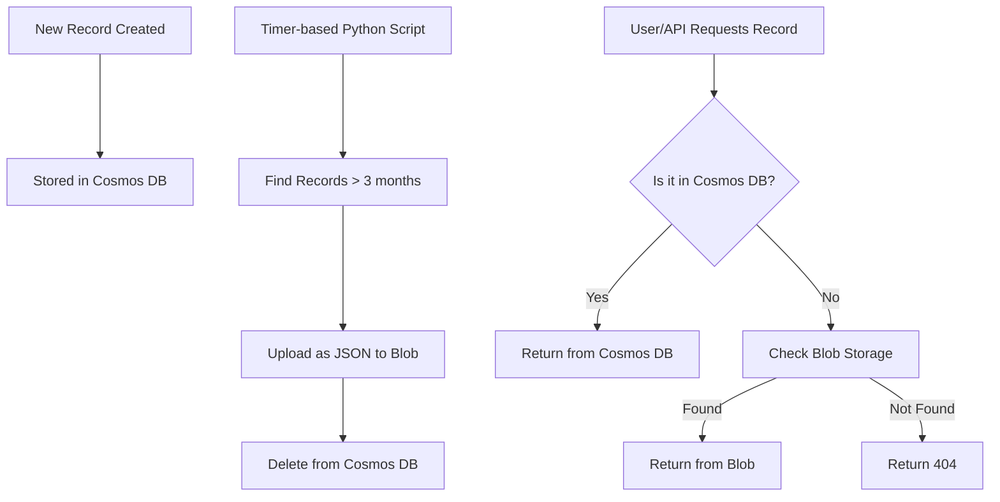

## Requirement

You have a serverless application using Azure Cosmos DB to store billing records. You have over 2 million records, some as large as 300 KB each. Records older than 3 months are rarely accessed but must still be available on demand, ideally within a few seconds. Storage cost is growing rapidly in Cosmos DB.

You want to:

- Keep recent records in Cosmos DB.
- Move older records to cheaper storage (archive).
- Access both old and new records through the same API logic.
- Avoid any data loss or downtime.
- Keep the solution simple.
- Not change your existing read/write API contracts.

## Solution Overview

We will implement a **tiered storage strategy**:

| Layer         | Purpose                          | Service Used        | Cost  | Response Time    |
|---------------|----------------------------------|---------------------|-------|------------------|
| 🔴 Hot Layer  | Store recent records (≤ 3 months) | Azure Cosmos DB     | High  | Fast             |
| 🟢 Cold Layer | Archive older records (> 3 months)| Azure Blob Storage  | Low   | Slower (1–2 sec) |

### Services Used & Why

| Service             | Why We're Using It                                                             |
|---------------------|--------------------------------------------------------------------------------|
| Azure Cosmos DB     | Fast, globally distributed NoSQL DB for current (hot) data                    |
| Azure Blob Storage  | Cheap, scalable storage for large, infrequently accessed JSON data            |
| Python Script       | Automates movement of old data and fetch fallback                            |
| JSON Format         | Native data format for Cosmos and easy to store/parse                         |

## Step-by-Step Implementation Guide

### 1. Setup in Azure Portal

#### Step 1: Create Resource Group

1. Visit https://portal.azure.com  
2. Search for **Resource groups** → Click **+ Create**  
3. Fill:  
   - **Resource Group Name**: `BillingAppRG`  
   - **Region**: Choose nearest (e.g., Central India)  
4. Click **Review + Create** → **Create**

#### Step 2: Create Cosmos DB

> _Skip if already exists._

1. Search **Cosmos DB** → Click **+ Create**  
2. Choose **Core (SQL)** → Click **Create**  
3. Fill:
   - **Resource Group**: `BillingAppRG`
   - **Account Name**: `billingcosmos123`
   - **Region**: Same as above
   - **Apply Free Tier**: Yes (if available)
4. After creation:
   - Go to resource → **Data Explorer**
   - Click **New Container**
     - **Database**: `BillingDB`
     - **Container**: `BillingRecords`
     - **Partition Key**: `/userId`

#### Step 3: Create Blob Storage Account

1. Search **Storage Accounts** → Click **+ Create**  
2. Fill:
   - **Resource Group**: `BillingAppRG`
   - **Storage Account Name**: `billingarchive123`
   - **Region**: Same as Cosmos DB
   - **Redundancy**: LRS (default)
3. After creation:
   - Go to Storage Account → **Containers**  
   - Click **+ Container**  
     - **Name**: `billing-archive`  
     - **Public Access**: Private

#### Step 4: Get Access Credentials

- **Cosmos DB**:
  - Go to `billingcosmos123` → Left Menu → **Keys**
  - Copy: URI & PRIMARY KEY

- **Blob Storage**:
  - Go to `billingarchive123` → Left Menu → **Access Keys**
  - Copy: Connection String

## 2. Python Script to Archive Old Records

### Install Required Packages

```bash
pip install azure-cosmos azure-storage-blob python-dateutil
```

### Python Script

```python
from azure.cosmos import CosmosClient
from azure.storage.blob import BlobServiceClient
from dateutil.parser import parse
from datetime import datetime, timedelta
import json

COSMOS_ENDPOINT = "https://<your-cosmos-account>.documents.azure.com:443/"
COSMOS_KEY = "<your-cosmos-key>"
DATABASE_NAME = "BillingDB"
CONTAINER_NAME = "BillingRecords"

BLOB_CONNECTION_STRING = "<your-blob-storage-connection-string>"
BLOB_CONTAINER_NAME = "billing-archive"

cosmos_client = CosmosClient(COSMOS_ENDPOINT, COSMOS_KEY)
database = cosmos_client.get_database_client(DATABASE_NAME)
container = database.get_container_client(CONTAINER_NAME)

blob_service = BlobServiceClient.from_connection_string(BLOB_CONNECTION_STRING)
blob_container = blob_service.get_container_client(BLOB_CONTAINER_NAME)

cutoff_date = datetime.utcnow() - timedelta(days=90)

def archive_old_records():
    print("Starting archival process...")
    query = "SELECT * FROM c WHERE c.timestamp < @cutoff"
    items = container.query_items(
        query=query,
        parameters=[{"name": "@cutoff", "value": cutoff_date.isoformat()}],
        enable_cross_partition_query=True
    )

    for item in items:
        record_id = item['id']
        timestamp = parse(item['timestamp'])
        date_path = timestamp.strftime("%Y/%m/%d")
        blob_name = f"{date_path}/{record_id}.json"

        try:
            blob_container.upload_blob(name=blob_name, data=json.dumps(item), overwrite=True)
            print(f"Uploaded {blob_name} to blob.")
            container.delete_item(item=record_id, partition_key=item['userId'])
            print(f"Deleted {record_id} from Cosmos DB.")
        except Exception as e:
            print(f"Error archiving {record_id}: {e}")
```

### Run the Script

```bash
python archive_old_records.py
```

> Optional: Convert to an Azure Function (Timer Trigger) later for automation.

## 3. Backend Fallback API to Read Record

```python
def get_record(record_id, user_id):
    try:
        item = container.read_item(item=record_id, partition_key=user_id)
        return item
    except:
        today = datetime.utcnow()
        for y in range(today.year - 2, today.year + 1):
            for m in range(1, 13):
                for d in range(1, 32):
                    blob_path = f"{y}/{m:02}/{d:02}/{record_id}.json"
                    try:
                        blob_client = blob_container.get_blob_client(blob_path)
                        blob_data = blob_client.download_blob().readall()
                        return json.loads(blob_data)
                    except:
                        continue
        return {"error": "Record not found"}
```

> Optional: Maintain a lookup index in Cosmos DB to avoid scanning all paths.

## Example JSON Record

```json
{
  "id": "record123",
  "userId": "user456",
  "timestamp": "2025-04-18T10:22:00Z",
  "amount": 5000,
  "status": "paid"
}
```

## Visual Diagram (Tiered Storage Flow)



## Common Errors & Troubleshooting

| Problem                | Solution                                          |
|------------------------|---------------------------------------------------|
| Record not deleted     | Check if `partition_key` is correct               |
| Can't connect to services | Verify URI, keys, connection strings           |
| Read too slow          | Add index table or pre-compute blob path         |
| Storage cost still high| Move blobs to **Cool** or **Archive** tier       |

## Summary Task Technology

| Task                      | Technology            |
|---------------------------|------------------------|
| Current hot data          | Azure Cosmos DB       |
| Archived data (>3 months) | Azure Blob Storage    |
| Archiving process         | Python script         |
| Read fallback             | Same API, with fallback logic |
